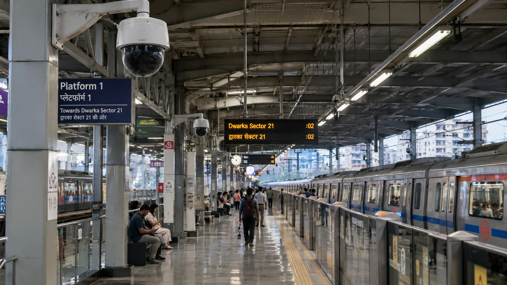

# Photos to supply

Every page currently shows dashed grey boxes where a photograph should go. Each box
names the file it is waiting for and describes the shot. There are **36 photo slots
plus 4 leadership portraits**, but you do not need all of them to launch — the
"Start with these" list below covers the ones people actually see.

## How to drop a photo in

1. Save the file into `assets/photos/` using **exactly** the filename shown in the box.
2. Open the page body in `_bodies/` and replace the placeholder `<div>` with an ``:

   ```html
   <!-- before -->
   <div class="ph w">
     <svg class="ico" ...></svg>
     <span class="tag">Photo needed</span>
     <b>Wide shot of a live control room…</b>
     <span class="f">assets/photos/hero-control-room.jpg — 1600×900</span>
   </div>

   <!-- after -->
   
   ```

   Use `pic-w` for 16:9 boxes, `pic-s` for 4:3, `pic-t` for the wide banner —
   these match the `w` / `s` / `t` classes on the placeholder you are replacing.
3. Run `python build.py` to rebuild the pages.

## Shooting notes

- **Use photographs of your own sites and staff.** A slightly imperfect photograph of
  one of your own installations is more convincing than a polished stock image.
- **Landscape, plenty of light**, and leave a bit of empty space around the subject —
  the boxes crop to a fixed shape.
- **No identifiable students or children**, particularly on the KGBV school photos.
  Shoot buildings, corridors and equipment instead.
- **Check the client is willing** before publishing a photo taken on railway, defence
  or government premises. When in doubt, use a generic shot of similar equipment.
- Save as JPEG, quality around 80, and keep each file under roughly 400 KB.

## Start with these eight

If you only have time for a handful, these carry the most weight:

| File | Shot |
| --- | --- |
| ~~`hero-control-room.jpg`~~ | Front page hero. **Supplied — in place.** |
| `about-office.jpg` | The Moula Ali office — building front with signage. |
| `about-engineers.jpg` | Two engineers aligning a camera, in uniform and safety gear. |
| `control-room.jpg` | Operator at a desk with a video wall behind. |
| `training-class.jpg` | A class in progress with trainees at work. |
| `project-railway-platform.jpg` | An MMTS platform with our cameras on the canopy. |
| `project-orr-wide.jpg` | Wide banner shot of the Outer Ring Road with a camera gantry. |
| `contact-office.jpg` | The office entrance, so a visitor recognises the building. |

---

## Full list, page by page

### Home — `index.html`

| File | Size | Shot |
| --- | --- | --- |
| ~~`hero-control-room.jpg`~~ | 1600×900 | **In place.** Station platform with PTZ dome cameras on the canopy. |
| `work-scr-secunderabad.jpg` | 1200×675 | Goods shed or MMTS platform with a camera pole in frame. |
| `work-kgbv-schools.jpg` | 1200×675 | KGBV school building exterior, or a hostel corridor with a dome camera. |
| `work-gmr-orr.jpg` | 1200×675 | Outer Ring Road gantry with cameras, taken from the shoulder. |
| `work-scr-hyderabad.jpg` | 1200×675 | Signalling relay room rack with a camera, or a station approach at night. |
| `work-ser-ranchi.jpg` | 1200×675 | Level crossing gate with a camera mounted on the gate post. |
| `sector-railways.jpg` | 1000×750 | Station platform, cameras and passengers. |
| `sector-government.jpg` | 1000×750 | Government building or school campus. |
| `sector-industry.jpg` | 1000×750 | Factory floor or plant gate. |
| `sector-logistics.jpg` | 1000×750 | Warehouse aisle with a dome camera overhead. |
| `sector-traffic.jpg` | 1000×750 | City junction with traffic cameras on a gantry. |
| `sector-corporate.jpg` | 1000×750 | Office reception with a face reader at the turnstile. |
| `training-centre.jpg` | 1000×750 | Trainees at work — wiring bench, sewing unit or a site class. |

### About us — `about.html`

| File | Size | Shot |
| --- | --- | --- |
| `about-office.jpg` | 1000×750 | The Moula Ali office — building front with signage, or the team at the entrance. |
| `about-engineers.jpg` | 1000×750 | Two engineers on a ladder aligning a camera, in OSSS uniform and safety gear. |

**Leadership portraits.** Four grey boxes marked "Photo portrait 600×720" sit beside the
bios. Head-and-shoulders, plain background, same crop for everyone — a set that does not
match looks worse than no photos at all. Save them as
`assets/photos/team-<surname>.jpg` and replace each `<div class="av">…</div>` with
`.jpg" alt="Name">`.

### Security systems — `security.html`

| File | Size | Shot |
| --- | --- | --- |
| `cam-dome.jpg` | 1200×675 | Close-up of a dome camera on a corridor ceiling. |
| `cam-bullet.jpg` | 1200×675 | Bullet camera on a perimeter pole against the sky. |
| `cam-ptz.jpg` | 1200×675 | PTZ camera mounted high, ideally mid-rotation. |
| `cam-thermal.jpg` | 1200×675 | Thermal camera housing, or a thermal image of a perimeter at night. |
| `cam-anpr.jpg` | 1200×675 | Number plate camera at a gate, with a vehicle passing. |
| `control-room.jpg` | 1000×750 | Operator at a control room desk, video wall showing several feeds. |
| `maintenance.jpg` | 1000×750 | Technician servicing a camera or opening an NVR rack. |

The five camera photos can come from a manufacturer's product images if you have
permission — for these, a clean product shot is fine.

### Skill development — `training.html`

| File | Size | Shot |
| --- | --- | --- |
| `training-class.jpg` | 1000×750 | A class in progress — trainer demonstrating, trainees watching. |
| `trade-construction.jpg` | 1200×675 | Trainees on a masonry or bar-bending exercise. |
| `trade-electrical.jpg` | 1200×675 | A trainee wiring a distribution board on a practice panel. |
| `trade-carpentry.jpg` | 1200×675 | Carpentry workshop, trainee at a bench with hand tools. |
| `trade-textiles.jpg` | 1200×675 | Row of sewing machines with trainees working. |
| `trade-renewables.jpg` | 1200×675 | Trainees fitting a solar panel on a rooftop rig. |
| `trade-healthcare.jpg` | 1200×675 | Attendants practising on a demonstration bed. |
| `trade-agriculture.jpg` | 1200×675 | Farm training session in a field or demonstration plot. |
| `trade-computers.jpg` | 1200×675 | Computer lab with trainees at desktops. |

Get written consent from trainees before publishing photographs of them.

### Our work — `projects.html`

| File | Size | Shot |
| --- | --- | --- |
| `project-railway-platform.jpg` | 1200×675 | MMTS platform with our cameras on the canopy, daylight. |
| `project-relay-room.jpg` | 1200×675 | Relay room interior with equipment racks and a camera in the corner. |
| `project-kgbv.jpg` | 1000×750 | KGBV school or hostel block exterior — no students in frame. |
| `project-orr-wide.jpg` | 2000×860 | Wide Outer Ring Road shot with a camera gantry. Full-width banner. |

### Contact us — `contact.html`

| File | Size | Shot |
| --- | --- | --- |
| `contact-office.jpg` | 1000×750 | The office entrance or reception, so a first-time visitor recognises it. |

---

## Client logos

The five logos in `assets/` (Indian Railways, Government of Andhra Pradesh, GMR,
Indian Air Force, BFSI Sector Skill Council) are already in place and run in the
scrolling strip under the home page hero. If you add more, keep them as PNGs with a
transparent background and roughly the same height — the strip greys them out and
brings the colour back on hover, and mismatched heights show up immediately.
